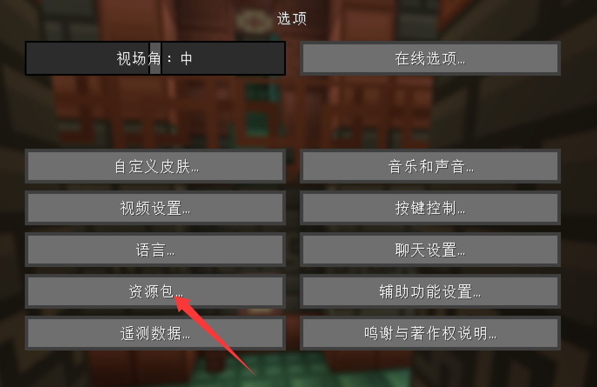
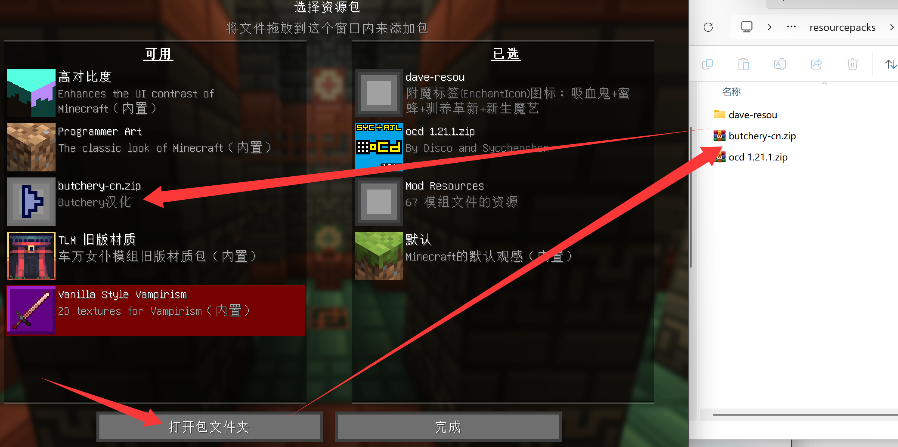

# Butchery 汉化包
## 这是什么
Minecraft mod [Butchery](https://www.mcmod.cn/class/13840.html) ([curseforge](https://www.curseforge.com/minecraft/mc-mods/butchery)) 的汉化资源包。

## 使用方法
1. 下载资源包
    - 点[这个链接](../../releases)，下载`butcher-cn.zip`
2. 把下载的压缩包放进 `resourcepacks` 文件夹里
    - 不知道在哪可以先启动游戏，进入“选项”、“资源包”，点击“打开资源包文件夹”
3. 在游戏中启用
    - 

依次进入“选项”、“资源包”

    - 

在左侧找到有**Butchery汉化**字样的zip，点击▶️形按钮

    - 点击完成
 

## 关于辅助汉化的脚本
写一下脚本的使用方法免得自己忘了怎么用。。。
1. 把最新的语言文件（解压mod，里面的`assets/butcher/lang/en_us.json`）放在readme.md同一个目录下
1. 把手册文件夹（解压mod，里面的`assets/butcher/patchouli_books/butchers_guide`）也复制过来
1. 运行`npm run diff`以生成差异
1. 打开生成的`diff.json`开始逐条翻译
    - `diff2.json`有id-旧英文文本-新英文文本-旧中文翻译的对照，用于导入表格工具对照以便翻译
    - `diff3.json`同上，但不是更新差异而是全部的对照
1. 打开`diff_butchers_guide/zh_cn`文件夹，把里面的json文件挨个翻一遍
1. 翻译结束后运行`npm run merge`合并结果